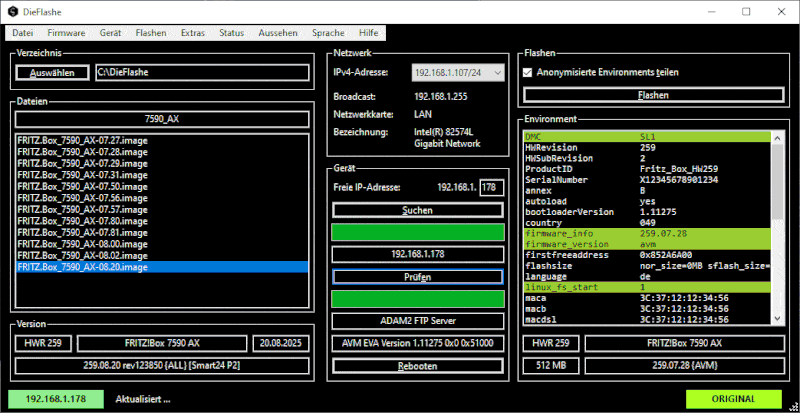

# DieFlashe

Flashtool für Geräte von FRITZ! aka AVM.

DieFlashe ist unabhängig von FRITZ! aka AVM.

Wenn das Programm gefällt würde ich mich über eine Donation freuen.

### Haftungsausschluss
Es gibt keine Garantie, Gewährleistung oder Haftung jeglicher Art.
Die Software ist wie sie ist und nach bestem Wissen und Gewissen erstellt.
Die Nutzung erfolgt auf eigene Gefahr und jegliche daraus resultierenden Schäden wie zum Beispiel an Hard- oder Software müssen selbst getragen werden.
Bei Unsicherheit bitte einfach nicht installieren.

### Datenübertragung
Falls Datenübertragungen aktiviert wurden, werden anonymisierte Environments übertragen die bei der Weiterentwicklung helfen.
So werden sie von Zeit zu Zeit zum Beispiel Emulia hinzugefügt.
Sie können im Upload-Verzeichnis vorab eingesehen und mit denen im Environments-Verzeichnis verglichen werden.
Da diese anonymisiert und nicht zuordenbar sind ist keine Auskunft oder Löschung möglich und es wird darauf verzichtet.
Vielen Dank für's Teilen!

### Firewall
Bei Verbindungsproblemen sollte die Windows-Firewall im Startmenü mit 'Firewall konfigurieren' für alle IP-Bereiche und Profile konfiguriert werden.
Besonders nach einem Wechsel zwischen den x86 und x64 Versionen wodurch sich der Programmpfad ändert.

### Tipps & Tricks
 - Der Bootloader unterstützt nur die native Netzwerk-Geschwindigkeit, also keine 100Mbit am 1Gbit-Port.
 - Ein zusätzlicher Switch zwischen den Geräten hilft auch bei Problemen mit Media-Sense von Windows.
 - IPv6 wird vom Bootloader nicht unterstützt und wird ignoriert.
 - Eine statische IPv4 für den Computer kann Verbindungsprobleme beheben.
 - Der IPv4-Gateway und -DNS sind überflüssig und werden ignoriert falls sie gesetzt sind.
 - Jede beliebige IP ist nutzbar, nicht nur die aus dem Bereich 192.168.178.1/24.

### Environment
 - Manche Variablen werden nach einem Neustart zurückgesetzt.
 - Andere Variablen können nicht geändert werden werden.
 - Die wenigsten Variablen sollten geändert werden werden!
 - firmware_version: Das Branding ('avm', 'avme', '1und1', ...).
 - firmware_info: Der Zusatz ',recovered=1' löscht das NAS.
 - linux_fs_start: Die Bootpartition ('0' oder '1'). Existiert nicht nach einem Recovery und lädt '0'.
 - provider: Provider-Additive (Dateiname oder existiert nicht). Kein Recovery verwendbar falls Additive existieren.
 - DMC: Retailgerät (existiert nicht, 'RTL=y', 'RTL=y,SL1', ...). Keine Updates möglich falls als nicht-Retailgerät gesetzt.

### Versionen
 - Die .Net 6 Version (EOL) benötigt Windows x86 ab 7.
 - Die .Net 10 LTS Version benötigt Windows x64 ab 10.

Empfohlen ist die x64 Version da diese keine RAM-Beschränkung aufweist.

### Installation
 - Mit der `setup.exe` aus der `.zip` wird falls nötig .Net automatisch heruntergeladen und installiert.
 - Die `.msi` installiert nur das Programm ohne die Voraussetzungen zu prüfen oder installieren.

### Links
 - [Features](FEATURES.md)
 - [Changelog](CHANGELOG.md)
 - [Releases](https://github.com/DieFlashe/dieflashe/releases)
 - [Discussions](https://github.com/orgs/DieFlashe/discussions)
 - [Github](https://github.com/DieFlashe/)

